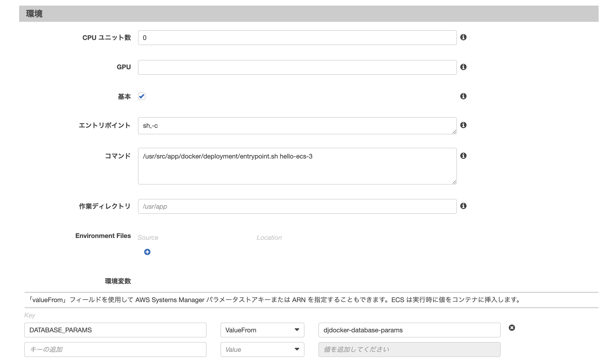

# Docker

## CMD: Replace CMD in Dockerfile on up and ruuning.

`/usr/src/app/docker/deployment/entrypoint.sh hello-container-2` is to be executed:

~~~bash
% docker run -t -p 9000:80 xxxxxxx.dkr.ecr.ap-northeast-1.amazonaws.com/djdocker:latest /usr/src/app/docker/deployment/entrypoint.sh hello-container-2
~~~

### ECS: Task Definition

~~~json
entrypoint: ["sh","-c"]
command: ["/usr/src/app/docker/deployment/entrypoint.sh hello-ecs-3"]
~~~

